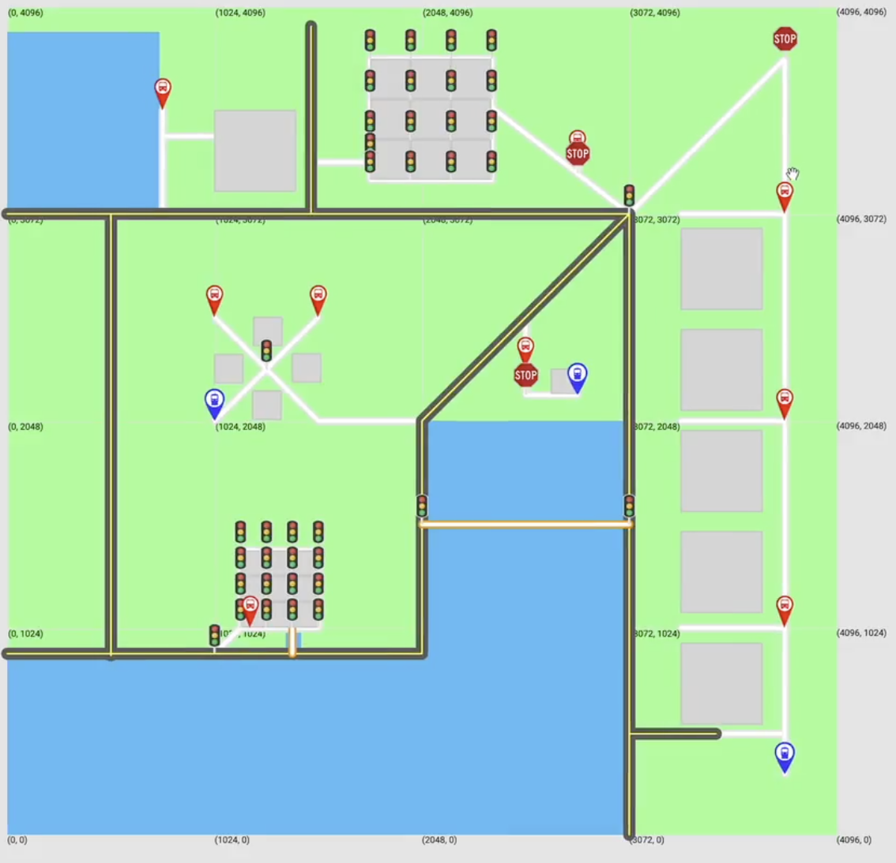

# Map Generator (.mg)

A VS Code extension and language server for designing 2D maps with a custom `.mg` DSL. Write high-level map instructions (markers, roads, buildings, water, loops, functions) and preview the result instantly on a Google Maps canvas served locally.

## What you can do
- **Author maps in a DSL** – `CREATE` markers (bus stops, traffic lights, stop signs, train stops), streets/highways/bridges (polylines), buildings/water (polygons), and set canvas size.
- **Programmatic layouts** – variables, constants, arithmetic/boolean expressions, functions (with recursion), loops, and if/else so you can generate grids, patterns, or procedurally vary geometry.
- **Live diagnostics** – syntax/semantic checking, semantic tokens, and inline errors as you type in VS Code.
- **One-click preview** – toolbar command (`Open Map`) renders the current `.mg` file at `http://localhost:1337`; refresh to see edits or click the toolbar icon again.
- **Sample library** – `user/` holds ready-to-run `.mg` examples; `docs/codeSamples` + `docs/mapSamples` pair code and rendered maps for reference.

## Tech stack
- **Editor/Language Server:** VS Code extension + LSP (TypeScript), ANTLR4 grammar for `.mg`.
- **Renderer:** Express map server that parses the current buffer, builds create statements, and serves a Google Maps JS view with custom tiles and legend.
- **Build:** TypeScript project references, Webpack for the web bundle.

## Project structure
```
/client         # VS Code extension host + web map (HTML/CSS/TS)
/server         # Language server + map server (Express) + ANTLR parser
/docs           # User docs, code samples, rendered map images
/user           # Sample .mg files to try immediately
/docs/milestones # Planning artifacts (kept for history)
```

## Setup
1. Install Node.js 18+ and VS Code 1.63+.
2. From the repo root, install dependencies (runs client + server installs):
   ```bash
   npm install
   ```
3. Build the extension and web assets:
   ```bash
   npm run compile          # macOS/Linux
   # or
   npm run compileWin       # Windows
   ```

## Usage (VS Code)
1. Open the project in VS Code.
2. Run and Debug → **Launch Client** (starts the language server and map server on port 1337).
3. Open any `.mg` file (see `user/` for samples).
4. Click the wrench/“Open Map” icon in the editor title bar (or browse to `http://localhost:1337`). Refresh after edits; diagnostics appear inline.

## Notes
- The demo map page includes a Google Maps API key in `client/src/index.html`. For production, replace it with your own key.
- If the preview seems stale, close the debug session and relaunch **Launch Client** (the map server re-reads `USER_INPUT.mg` each time).

## Screenshot


